## Why

Ever since I switched to a Mac with Apple silicon, I've wanted to build myself a Windows box. But putting together a full-size PC didn't appeal — my place is already cluttered with junk. I'd made a couple of attempts at a mini-PC on old hardware: the HP T610 Plus almost worked, but I dropped a drive into it and fried it. I've since revived it, though the machine is really more of a retro box — for Win 9x, XP, 7. I was surprised to learn, by the way, that even Windows 10 no longer gets updates. But that's beside the point.

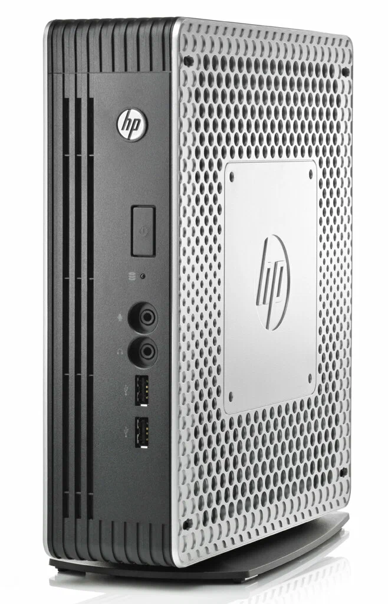

[HP T610 Plus — a thin client that makes a decent retro box](https://www.parkytowers.me.uk/thin/hp/t610/)

| | HP T610 Plus |
|---|---|
| CPU | AMD G-T56N — 2/2, Bobcat, 1.65 GHz, 18 W |
| GPU | Radeon HD 6320 (integrated) + GT 730 2 GB DDR3 |
| RAM | 2× DDR3 SO-DIMM, up to 8 GB |
| storage | SATA DOM 16 GB, SSHD 500 GB, IDE DOM 2 GB |
| slot | 1× PCIe x16, low-profile |

There's also a Chromebox: I flashed a custom BIOS, put in a bigger drive, got Windows onto it — but the hardware turned out too weak even for older Win 10 builds.

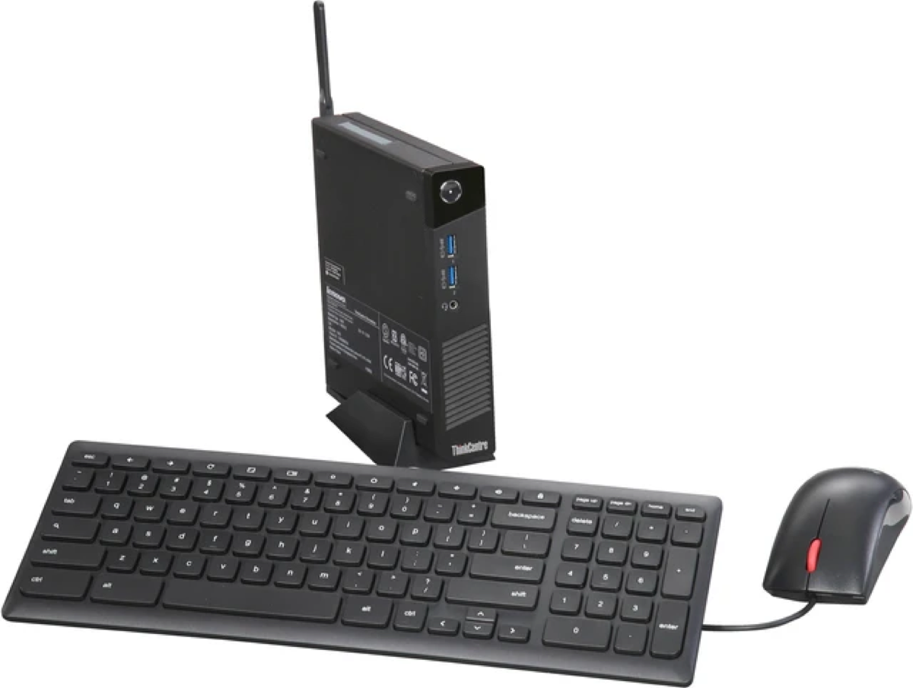

| | ThinkCentre Chromebox |
|---|---|
| CPU | Celeron 3205U — 2/2, Broadwell, 1.5 GHz, 15 W |
| GPU | Intel HD Graphics (Broadwell) |
| RAM | 4 GB, single stick |
| storage | mSATA SSD, 16 → 128 GB |
| slots | a pair of mPCIe |

Anyway, for the past few years I couldn't shake the idea of building a mini-PC, ideally with a discrete GPU. In the HP T610 I put a GT 730 — the last series with official XP support. But I still haven't actually played anything on it. I should 🙂

Honestly, I wasn't only thinking mini-PC — I'd have been fine with ITX too; that's what my last build back in Moscow was based on. But then the [memory shortage](https://dropreference.com/en/blog/news/shortage-ddr5-ram-global-status-july-2026) hit: even not-so-fresh DDR4 started costing silly money. So my eye fell on DDR3 platforms — if the memory's old anyway, I want more of it. And finding an ITX board with 4 memory slots is a tall order.

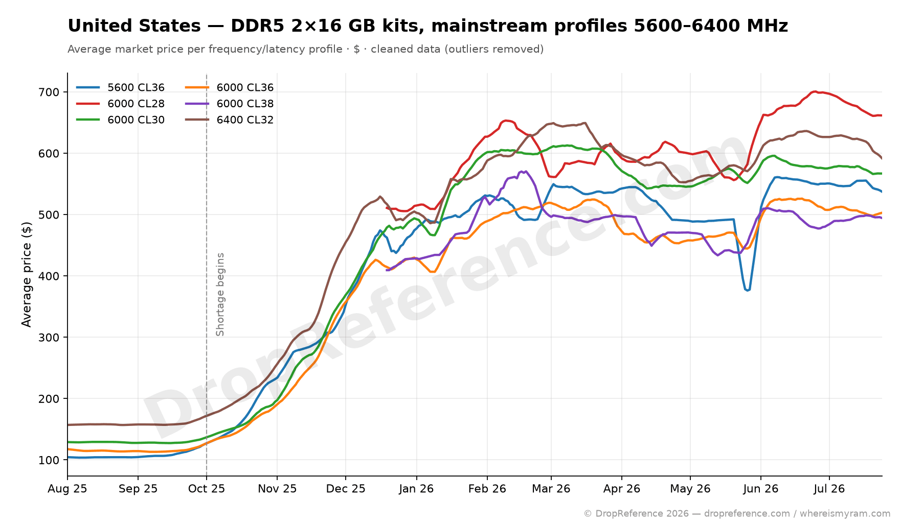

[DDR5 price chart, dropreference.com](https://dropreference.com/en/blog/news/shortage-ddr5-ram-global-status-july-2026)

At first I did look for compromises among mini-PCs. I eyed the HP t730 — like my 610 but newer; it would probably run happily with something like a GT 1030, but it's still a machine for undemanding games and software.

And then I broke out of the mini-PC box and discovered SFF. Turns out there's quite a lot of second-hand Dell gear in Serbia. First I found a Dell OptiPlex 3020 SFF, then learned it has bigger siblings — the 7020 and 9020 ([official 9020 SFF specs](https://www.dell.com/support/manuals/en-us/optiplex-9020-desktop/opt9020sffom-v2/specifications?guid=guid-0805b167-15c7-4302-a0b4-aabdc5e358a3&lang=en-us)). For 50–60 EUR you can find a machine that looks like a decent base for an upgrade:

- LGA1150 — you can drop in Haswell, i.e. a 4th-gen i7 or Xeon;
- 4 memory slots on the higher-end versions;
- a pair of PCIe slots — a topic of its own, since NVMe wasn't a thing here yet, so one slot goes to storage and the other to video;
- the size of "a thick ream of paper" — I even managed to stuff it into a backpack 🙂

## The trip

Well, as you can guess, I bought it. I rode to the other end of the city, right out in the sticks — I hadn't even realised this was still Belgrade. Turned out to be a workshop: piled high with gear of every vintage and condition, lots of decommissioned corporate machines. One of those was basically what I came for. Didn't take any photos inside, just this one — from outside and far away, but it captures the vibe exactly.

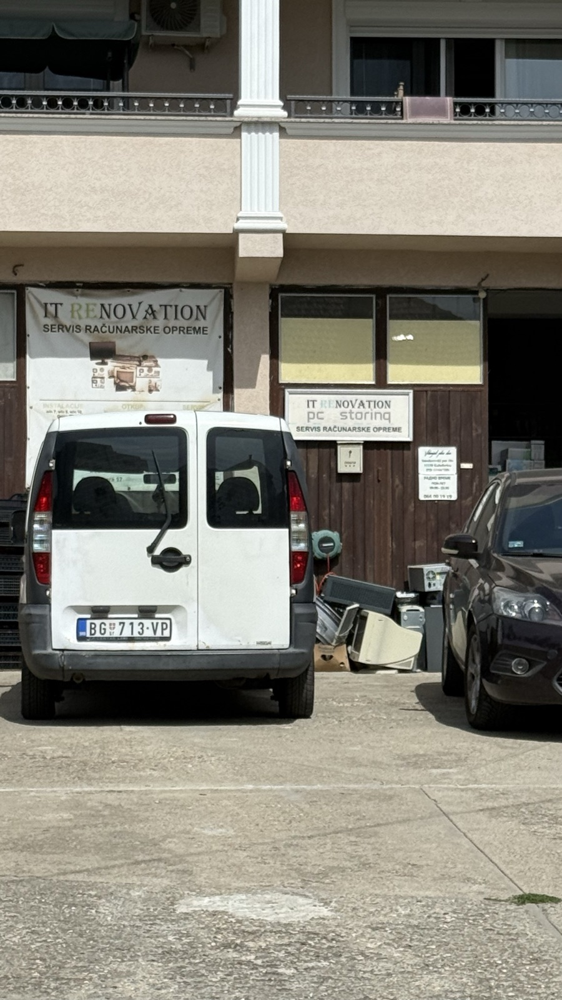

Once I managed to explain that we'd talked the day before, the owner pulled one unit out of a pile of identical machines and we went into a back room. We quickly swapped the memory (2×2 → 4×1), put in a 3.5" hard drive — just the first one off the pile, with Dell caddy rails, even though I said I didn't need it. Hooked up a monitor, I poked around the BIOS and decided I'd take it.

Right away, though, I spotted the main problem: the full-length x16 slot is placed as close to the PSU as possible. But I figured no big deal — handed over 3,600 dinars (30 EUR) and went off, pleased, to find a bus so I could actually get to work. The whole trip ran on the clock of a nominal lunch break.

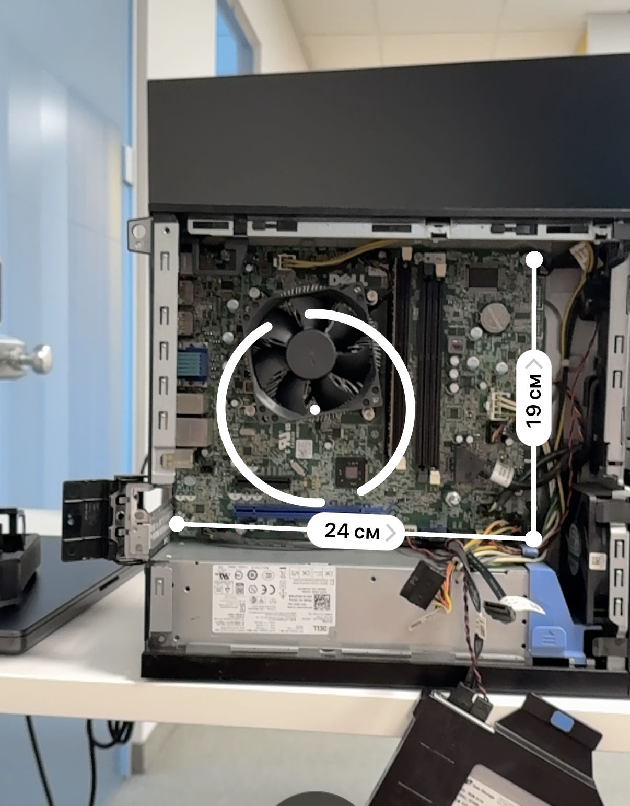

On the way to the office I made two purchases — memory and a CPU, both on AliExpress. Mine came with an i3, so I didn't think twice about a CPU upgrade — grabbed a Xeon E3-1271, pretty much the top for the platform. Beyond that you're overpaying for a few percent of performance and rarer chips, and a real modern AAA game will hit the wall of the old architecture and/or core count anyway. If it had come with an i5, I'd have sat on that for a while.

For memory I first thought I'd buy a single 4 GB stick, start at 8, then work up to 24. But I decided that buying a kit outright is more efficient money-wise — and I won't have to hunt for sticks later. The shortage will reach DDR2 soon enough 😄

At home I took it apart on the desk — working out what goes where.

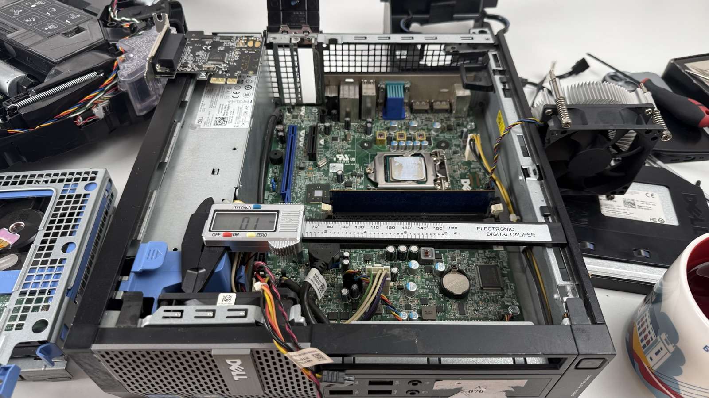

## The graphics card

The GPU is a story of its own. Originally I wanted to find a low-profile GTX 3050 6 GB. The trick with the 6 GB version is that it fits within the PCIe slot power budget and needs no extra power. Since the ports didn't work out, I decided to look at non-low-profile cards — I'd be bodging it anyway.

A few words on why the 3050: fairly power-efficient, yet it runs all the current NVIDIA tech — well, except [DLSS 5](https://www.nvidia.com/en-eu/geforce/news/dlss-5-3d-guided-neural-rendering/), which came out about three days ago. And it has enough memory to play games like Prey, Rome: Total War 2, and The Witcher 3 even at 4K.

I found a cheap one in Tyumen for 10,500, but they asked me to wait until Monday. So I sat down to wait and think about the bodging.

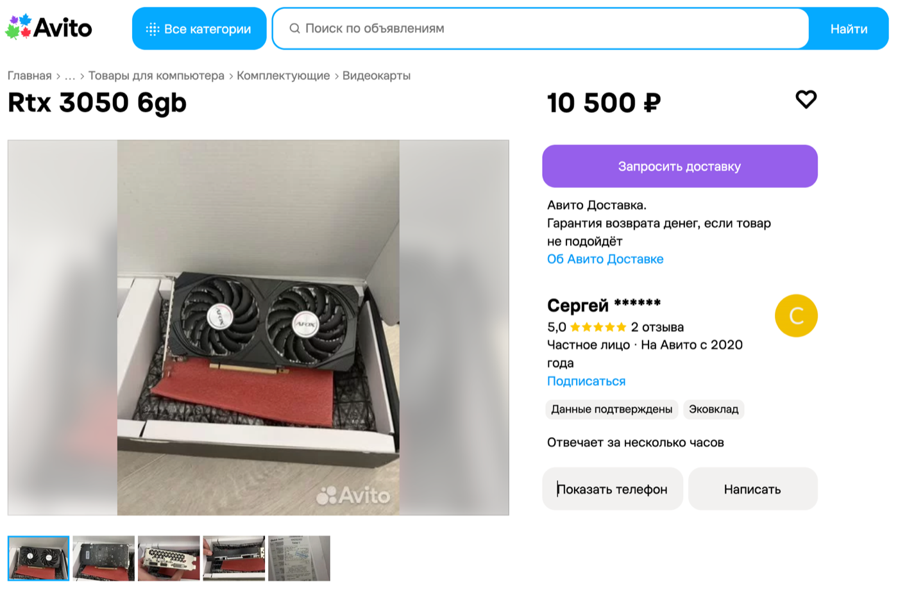

While I waited, I sketched out a brick of a case in my head: width and length to the motherboard's footprint. Graphics card on a riser and PSU in separate compartments, board and drives on top if needed. I nearly sat down to draw it in Fusion.

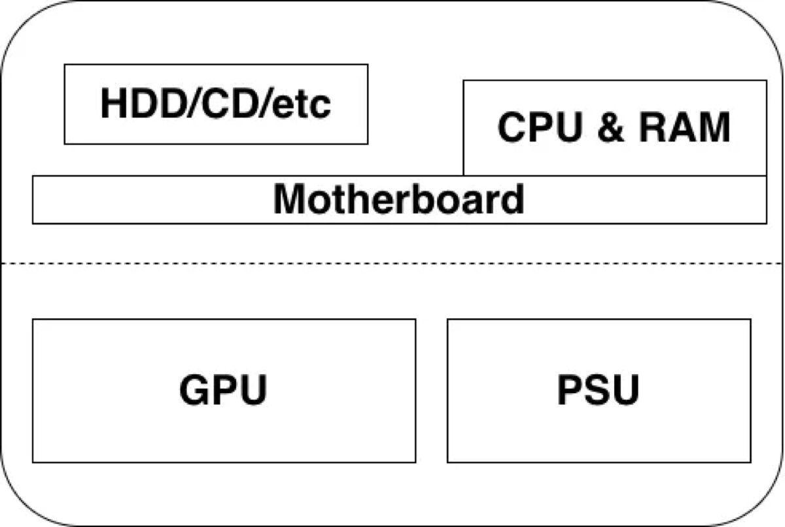

And then something made me search for a 3050 on AliExpress.

I thought I'd already been through every card option. The A2000s looked especially appealing — powerful and slim, but the price bites. And at some point, already closing yet another page, out of the corner of my eye I catch something unusual in the recommended items. I go back — same recommendations.

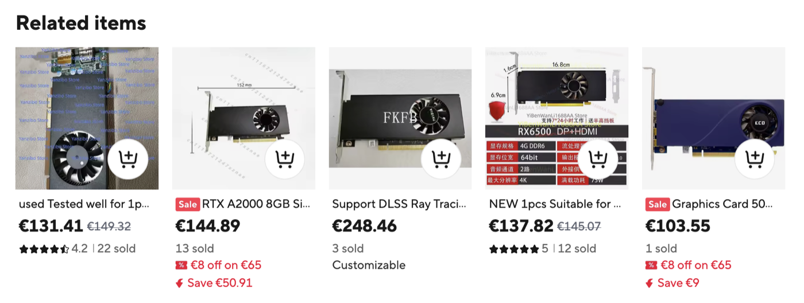

An A2000 for 150 bucks, and — crucially — shipping to Serbia for just 15, covered by a coupon. But hold on — 8 GB? The official versions only came in 6 and 12. First thought: trashed cards with dead memory chips or dead traces to them. Like, you take waterlogged cards, desolder the extras, mask off the addresses of the bad blocks — and there's your "8 out of 12."

But then I realise the card is single-slot! Which means it should fit my lower PCIe with no case surgery. Digging in, I understand: it's a mobile chip that's been adapted this way. There was a laptop version of the A2000 — it's weaker than the desktop one, but whatever: the point is it's faster than a 3050, needs no extra power, and even has a couple of extra gigs of memory.

Ordered it. Hasn't shipped yet, though it's been a day since the order. I'm nervous it'll get cancelled.

The lower slot is now for the GPU, and in the free PCIe x4 I ordered an NVMe adapter. I've got drives to spare — I'll probably drop in a 512 GB one. Failing that, there's a 7200 rpm 500 GB HDD =) I was pleasantly surprised there are ready-made solutions for booting from NVMe ([here's one for the OptiPlex 7020](https://tachytelic.net/2021/12/dell-optiplex-7020-nvme-ssd/)) — I thought I'd have to add a flash drive or a SATA DOM to host the bootloader.

All up from AliExpress: the graphics card, the CPU, a memory kit, and an M.2 → PCIe adapter.

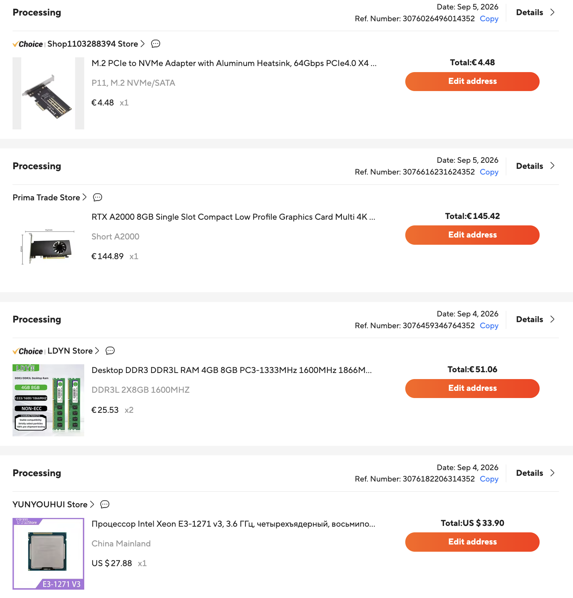

**PS.** While I was finishing this up, the seller did cancel the CPU — well, asked me to cancel it, said it was out of stock, though they didn't pull the listing. I lost patience and ordered a Core i7-4790K — the ceiling for the platform. It's apparently outside Dell's recommended thermal envelope, but it should run. So now it's hanging in limbo alongside the GPU, fraying my nerves.

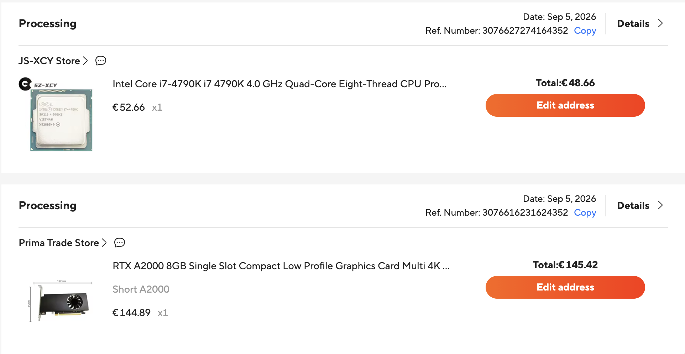

**PPS.** One last thing: the ideal mini build, in my mind, has always been something based on the Lenovo M920q.

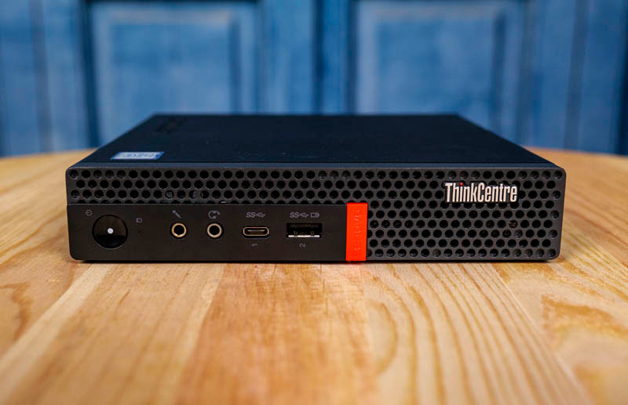

A mini-PC with two DDR4 slots, NVMe, and a PCIe slot you can use, via a riser, to run a full-size graphics card — the same A2000 or another single-slot card. It's basically the same bodge as mine, just more compact: people 3D-print brackets, lay the card "one floor up" above the case, and rig an external PSU for it. [Here's an M920q + RX 6400 build, for instance](https://www.reddit.com/r/sffpc/comments/1628znv/another_lenovo_tiny_m920q_rx_6400_build/) — that's roughly the look I'm heading for, just on an SFF case.

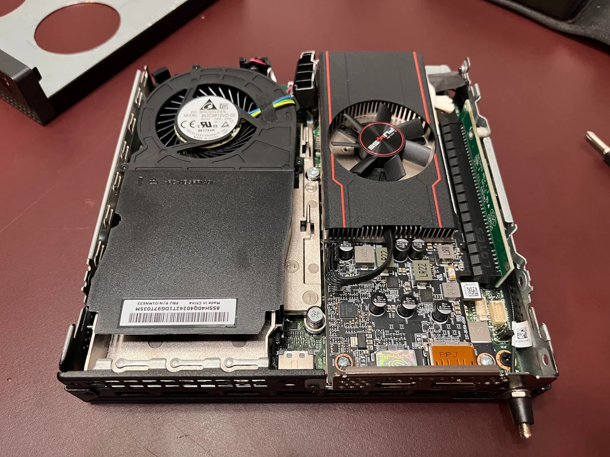

The CPUs here already go up to 16 threads. Yes, the power limits are tighter, but newer chips don't care. Depending on the workload you can gain 10–20% — and it's no longer a PC in a backpack, more like a PC in the palm of your hand. Prices for these start around 150 EUR now, and the CPU and memory are noticeably pricier too. Top-end i9s are 200+ dollars.

All told, it comes out to something like:

| part | price | what it gives |
|---|---|---|
| Lenovo M920q | ~$150 | base: 2× DDR4, M.2 NVMe, 1× PCIe (x8) |
| Core i9-9900T | ~$200 | 8 cores / 16 threads, 1.7–4.4 GHz, 35 W |
| DDR4 2×16 GB | ~$200 | 32 GB |
| RTX A2000 | ~$150 | 8 GB, 1 slot, no extra power |

And we're already past 700 bucks with duties and shipping. If you set out to do it — watch the local classifieds and assemble the machine over months — you could probably save a lot. But I don't have it in me 😄

With my build I'm hoping to just barely clear 300, though I originally figured 200-and-change. But I let myself splurge on almost every component except the base.

| part | price | what it gives |
|---|---|---|
| Dell OptiPlex SFF | €30 | LGA1150, 4× DDR3, PCIe x16 + x4 |
| Core i7-4790K | €50 | 4 cores / 8 threads, 4.0–4.4 GHz |
| DDR3L 2×8 GB | €50 | 16 GB |
| RTX A2000 8 GB | €145 | 8 GB, 1 slot, no extra power · Ampere: 2560 CUDA, 2nd-gen RT, DLSS 3.5 |
| M.2 → PCIe adapter | €5 | for NVMe |
| NVMe 512 GB | — | from my stash |

Anyway — I meant to write a short note about the plans and the trip. It turned into a mini-article. Something like that.
