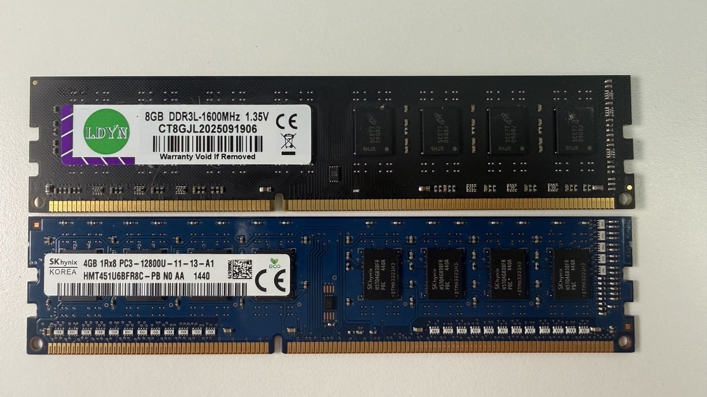
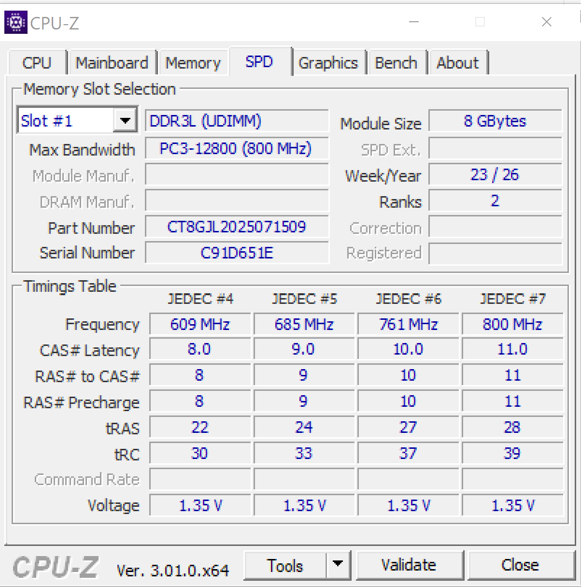
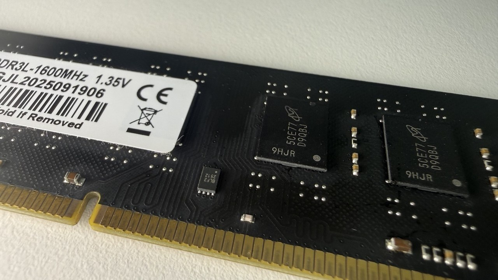
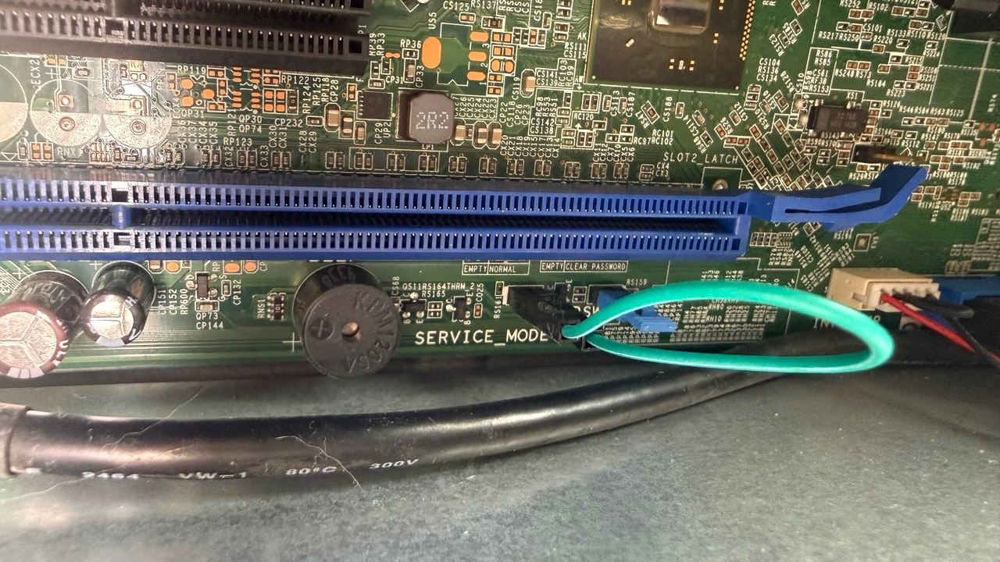
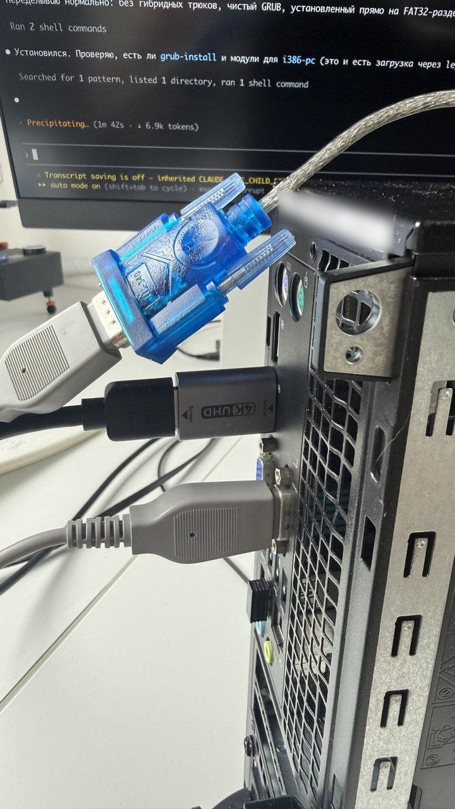
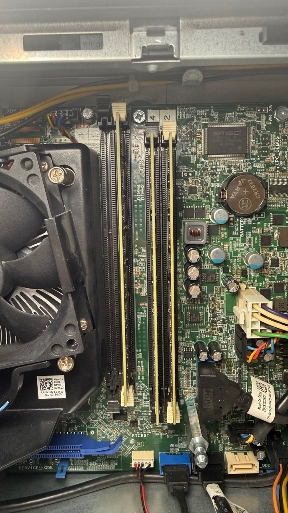

I'm building my [mini PC for gaming](mini-pc-defitsit.html).

Dell OptiPlex 9020 SFF, Q87 chipset, Core i3-4150 (an i7-4770k is on its way).

As planned, I bought [cheap no-name DDR3 on AliExpress](https://www.aliexpress.com/item/1005007108545241.html): 4×8 GB DDR3-1600 dual-rank. On the stock Dell BIOS with four sticks the system either hung on an endless black screen or gave a long beep and rebooted. My first thought was that I'd been sold obvious junk — a dead stick — or that one of my slots was dead. But I quickly shuffled sticks and slots around and found that the system boots fine with any three sticks in any slots. Three 8GB sticks is the maximum it boots with.



Fine, I thought, let's look at the stick specs in software. It turned out all four have the same serial number, so the rest of the SPD data isn't exactly trustworthy either. But that only made me more curious to figure out what exactly fails and why.



[Sample SPD readout from Thaiphoon Burner (txt)](../../files/articles/optiplex-spd-thaiphoon.txt)

## Custom BIOS

First I learned that SPD can be reflashed — for example, to cap the frequency or timings and give the system a chance to start in a gentler mode. After all, 32gb is the ceiling for Haswell, and this is no overclocker's board. Whichever way you look at it, it's an office workstation, and a proprietary one at that — which, by the way, means you can't just change the memory frequency in the BIOS, let alone flash the SPD chip on the RAM.



At some point I wondered whether there might be some BIOS hacks — after all, there's a patch for booting from NVMe drives. At first I dismissed the idea. But when I did search, I found out about libreboot. It's an open-source replacement for the stock BIOS: it boots faster, its memory init is open source, and it has a few other goodies. Including disabling some proprietary Intel junk. And my Dell is on the supported list. I built the firmware, set the service mode jumper — and flashed it. Libreboot 26.01rev1, based on coreboot with native raminit for Haswell — if that means anything to you.



Alas, the different memory init made no difference. With three sticks the system boots without problems. Add the fourth — raminit fails and the machine won't start. So the problem isn't just the stock BIOS: coreboot, with its more detailed log, showed exactly where things break. And yes, there are logs — you can read them on the built-in COM port. All you need is a good old null-modem cable and a second computer with a serial port. A USB adapter plus an M1 Mac did the job just fine. 115200 8N1 -> read the logs.



## What the log shows

```
Cannot fast boot: DIMMs have changed
raminit failed on step RST_NONT
...
C0.R2:  Left  Right  Width  Center
   B5:  336   368    32     352
RcvEn: Width of high region (32) too small
RcvEn problems on channel 0, byte 5
raminit failed on step RCVET
```

The first error, `RST_NONT`, can be ignored: coreboot noticed the sticks had changed and decided to set everything up from scratch. That's normal behavior.

`RCVET`, on the other hand, is the actual failure.

Here's how it works, in plain terms. Every time the machine powers on, the memory controller re-learns how to talk to the sticks — this is called memory training. One of the steps is picking the moment to "listen" for the stick's reply. The controller moves that moment in small steps and checks over what range the signal is caught reliably. The wider the range, the more margin there is.

A stick sends data over eight parallel lanes — bytes — and each is tuned separately. Healthy bytes have a stable zone of 56 ticks, but one has 32. Coreboot requires strictly more than 32 (open source for the win — you can see it right in the code), and it searches in steps of 8. So it fell short by exactly one step.

<iframe id="rcven-chart" src="../../files/articles/optiplex-9020/rcven-margin-chart.en.html" title="RcvEn margin per boot attempt" loading="lazy" style="width:100%;height:560px;border:0;display:block"></iframe>
<script>(function(){var f=document.getElementById('rcven-chart');function sync(){try{var d=f.contentDocument;if(!d||!d.documentElement)return;d.documentElement.setAttribute('data-theme',document.documentElement.getAttribute('data-theme')==='dark'?'dark':'light');f.style.height=d.documentElement.scrollHeight+'px';}catch(e){}}f.addEventListener('load',sync);window.addEventListener('resize',sync);new MutationObserver(sync).observe(document.documentElement,{attributes:true,attributeFilter:['data-theme']});})();</script>

| Byte | Margin (ticks) | |
|---|---|---|
| B0, B1, B2, B4 | 56 | fine |
| B3 | 48–56 | fine |
| **B5** | **32** | **borderline → fail** |

Log: [9020-4dimm-FAIL-RCVET.txt](../../files/articles/optiplex-9020/9020-4dimm-FAIL-RCVET.txt)

`C0.R2.B5` is an address: channel 0, rank 2, byte 5. A rank is one half of a dual-rank stick; to the controller it looks like a separate small stick. Rank 2 is the second stick in channel 0 — the fourth one. In the working three-stick setup its slot is empty.

Two sticks in one channel aren't a problem in themselves: in channel 1 they get along just fine. It's specifically channel 0 with a second stick that doesn't work.

## Experiments and reproducibility

Next I rearranged everything: swapped sticks around, moved a 4 GB single-rank stick between slots (it's easier on the controller), rebooted many times. The result was always the same:

| What I did | B5 margin | Log |
|---|---|---|
| 4 × 8 GB | 32 | [txt](../../files/articles/optiplex-9020/9020-4dimm-FAIL-RCVET.txt) |
| replaced one 8 GB with 4 GB in the other channel | 32 | [txt](../../files/articles/optiplex-9020/9020-4dimm-with4GB-FAIL-RCVET.txt) |
| put the 4 GB in the adjacent slot of the same channel | 32 | [txt](../../files/articles/optiplex-9020/9020-4dimm-attempt3-4GB-moved-FAIL-RCVET.txt) |
| same again | 32 | same file, second boot |

The other bytes wander by ±8 ticks from run to run. But B5 is identical every time, down to the tick. Too stable to be random.



So it's not a particular stick, not an oxidized slot and not an overloaded channel — I lightened the neighbor, changed the other channel, and B5 didn't care. The remaining suspects:

- the memory controller in the CPU (this particular chip);
- the contact in the CPU socket;
- the motherboard itself.

I couldn't narrow it down further without spare sticks.

The hardware here is marginal in itself — the stock BIOS was acting up too. Coreboot is just stricter: one attempt and it gives up (the code literally says `TODO: Try more than once`), and the threshold of 32 is nothing more than a heuristic.

## Gotchas

The identical serial numbers came back to bite separately: coreboot's fast boot compares SPD per slot, and since all the sticks have identical SPD down to the serial number, coreboot doesn't notice when identical modules are swapped and applies training from a different physical stick. The only way to reset the cache is to change the set of occupied slots.

A similar story with swapping the CPU: the i3-4150 and an i7 of the same generation have the same CPUID (306C3), and the cache reset on the ME "CPU replaced" signal is commented out in the code. With the same memory, the new CPU will boot on the old one's training. To force fresh training you need one boot on two sticks, and only then put the third back.

## Workaround

The working option for now is simply not to use the problem slot: three sticks, slot C0S1 empty. 24 GB, 16 of it in dual-channel. Works stably. But I want all 32 :)

## Next steps

1. **Replace the CPU** — even though the memory controller is the same in the i3 and the i7, the i7 has its own routing inside the package, plus the socket contact gets reseated. Another IMC chip may have more margin and pass training with four DIMMs at DDR3-1600. In theory, for a higher-tier CPU series both the bare silicon and the finished processor go through stricter testing.
2. **Drop the frequency to DDR3-1333** if the CPU swap doesn't help. That's what I wanted to do by flashing the SPD. Libreboot has no direct memory frequency setting — it's taken from the slowest stick's SPD, so it needs a patch in `init_mpll.c` capping tCK at `TCK_666MHZ` if any channel has two sticks. Or find a lower-frequency stick.
3. **Relax the threshold to `width < 32`** — as a last-resort diagnostic experiment. Not a solution as such: it would need a long memtest86+ run on a warmed-up machine, because a distorted DQS on non-ECC memory doesn't cause a boot failure, it causes silent flipped bits.

For deeper diagnostics it's worth building the firmware with `CONFIG_DEBUG_RAM_SETUP=y` — then the log includes the SPD decode and a per-sample RcvEn graph for each byte.

## Summary

Waiting for the i7. It's already in the country. If it doesn't help, I'll apply the 1333 patch, then relax the threshold if needed and run memtest.
If things get really sad, I'll buy another 9020 and pull a 4gb stick from it — at least for dual-channel :D And I'll give the second PC to someone :)

## UPD:
While waiting for the CPU, I did end up flashing a BIOS build that drops the memory frequency to 1333. Built it, flashed it — got 28gb working; with 32 training passes, but it still falls over later. I don't know yet whether to look for a pair of branded sticks or grab another 4gb and settle on a 4+4+8+8 configuration. So relaxing the threshold no longer looks particularly meaningful either: at 1333 MHz the full 32 GB can already get through all of memory training, and the problem shows up later in the boot.

### What the DDR3-1333 runs showed

The frequency-cap patch worked as intended: coreboot picks 666 MHz, i.e. DDR3-1333, usually with CL9. But the result wasn't in the spirit of "lowered the frequency — everything's fixed". The picture got more complicated.

On one of the first attempts with three sticks, raminit failed again on Receive Enable Training: the same byte 5 of channel 0 got a window 32 ticks wide. So lowering the frequency by itself didn't remove the marginality. Yet in later runs the same and even heavier configurations passed memory training completely.

The most interesting part is 32 GB. At DDR3-1600 four 8 GB dual-rank sticks consistently died right in RCVET on `C0.R2.B5`. At DDR3-1333 all four sticks can get through raminit completely: the controller sees 16 GB on each channel and `mc_init_done` comes back successfully. But after that the machine is still unstable — in one layout it reboots on the transition from romstage to postcar, in another it gets noticeably further and hangs when starting the additional CPU cores.

So lowering the frequency clearly increased the margin and got past the old failure point, but didn't fully solve the problem. It no longer looks like one specific "bad byte", but like general borderline stability of the memory subsystem under maximum load.

| Configuration | Capacity | Approx. number of ranks | Result at 1333 | Logs |
|---|---:|---:|---|---|
| 2×8 GB, one stick per channel | 16 GB | 4 | One fully successful boot; in another run memory init passed, but later it crashed at `clear_memory/init_pae_pagetables` | [OK](../../files/articles/optiplex-9020/02-666mhz-2dimm-8plus8-OK.txt), [crash](../../files/articles/optiplex-9020/03-666mhz-2dimm-crash-pae.txt) |
| 3×8 GB | 24 GB | 6 | Repeated late reboots, but the same configuration later booted all the way to the payload | [reboots](../../files/articles/optiplex-9020/04-666mhz-3dimm-crashloop-x5.txt), [OK](../../files/articles/optiplex-9020/05-666mhz-3dimm-24gb-OK.txt) |
| 3×8 GB + 1×4 GB single-rank | 28 GB | 7 | Fully successful boot twice, in two different slot layouts | [layout 1](../../files/articles/optiplex-9020/06-666mhz-4dimm-28gb-8-4-8-8-OK.txt), [layout 2](../../files/articles/optiplex-9020/09-666mhz-4dimm-28gb-diff-slots-OK.txt) |
| 4×8 GB dual-rank | 32 GB | 8 | Memory training passes completely, but then the system hangs/reboots: either at postcar or during AP init | [postcar](../../files/articles/optiplex-9020/07-666mhz-4dimm-32gb-8-8-8-8-stuck-postcar.txt), [AP init](../../files/articles/optiplex-9020/08-666mhz-4dimm-32gb-slots1and3-stuck-apinit.txt) |

It's especially clear how the maximum configuration changed:

| 4×8 GB | DDR3-1600 | DDR3-1333 |
|---|---|---|
| Controller frequency | 800 MHz | 666 MHz |
| Primary timings | CL11, 2T | CL9, 2T |
| Receive Enable Training | Consistent fail on `C0.R2.B5`, width = 32 | Can pass completely across all ranks |
| How far the boot gets | Never leaves raminit | Reaches postcar/ramstage and even AP init |
| Result | Doesn't start | Still unstable, but gets much further |
| Log | [txt](../../files/articles/optiplex-9020/9020-4dimm-FAIL-RCVET.txt) | [postcar](../../files/articles/optiplex-9020/07-666mhz-4dimm-32gb-8-8-8-8-stuck-postcar.txt), [AP init](../../files/articles/optiplex-9020/08-666mhz-4dimm-32gb-slots1and3-stuck-apinit.txt) |

There's one more oddity: late crashes also happened on lighter configurations, and the same layout could reboot several times in a row and then boot through to the payload normally. So for now I don't consider 28 GB some hard "platform limit". It looks more like 7 ranks already work reliably enough, while 8 ranks push the system right to the edge. Plus there's another intermittent problem somewhere nearby — the contact, the specific IMC, the motherboard, or quirks of native raminit.

The practical result for now: 28 GB as three dual-rank 8 GB sticks and one single-rank 4 GB — the first configuration with all four slots occupied that fully booted twice in different arrangements. The full 32 GB at 1333 already passes memory training, but there's no stable boot yet.
